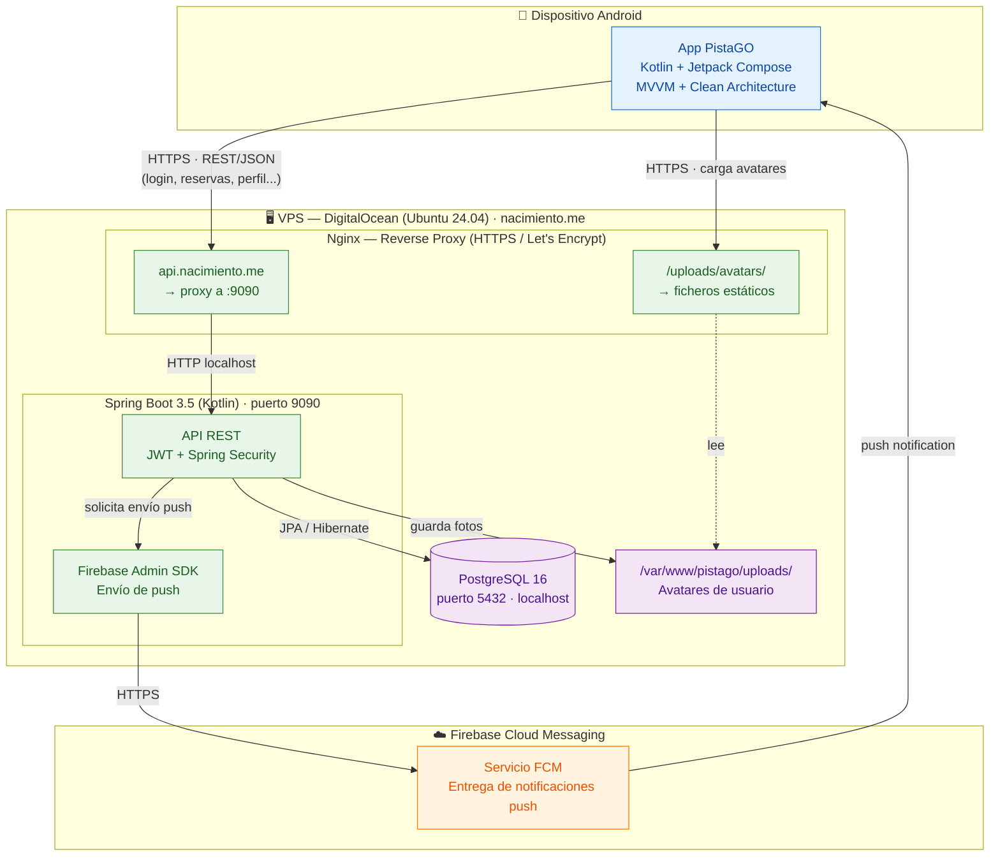
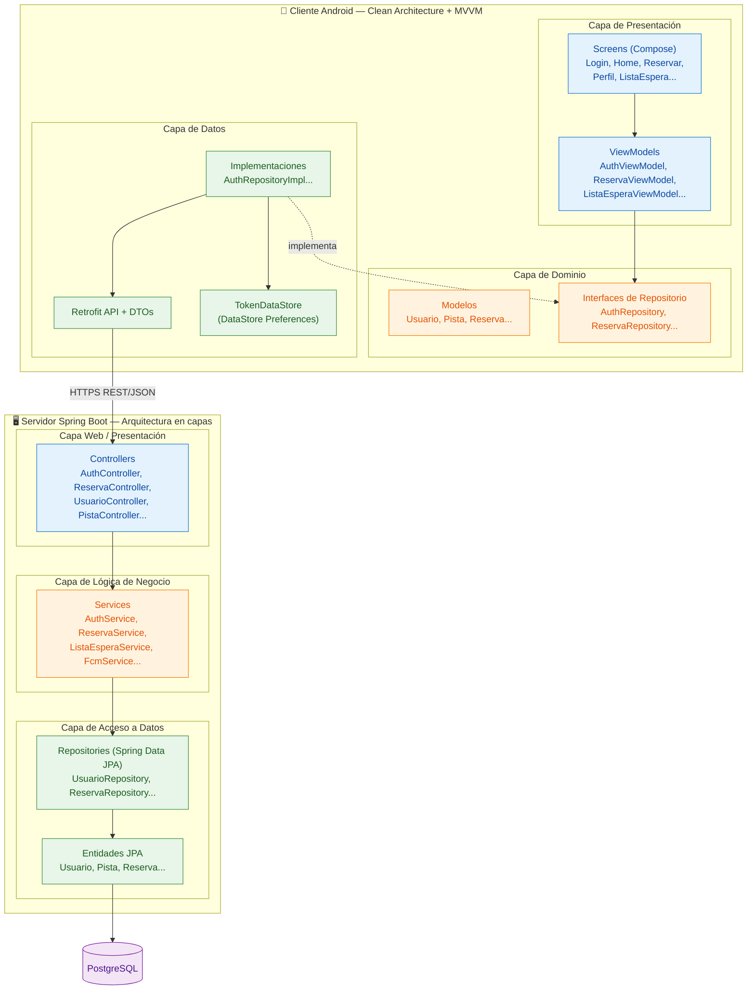

# Arquitectura del Sistema — PistaGO

Documentación de la arquitectura de PistaGO, sistema de gestión de reservas de pistas de tenis. Se incluyen dos vistas complementarias: el **diagrama de despliegue** (infraestructura física y comunicación entre componentes) y el **diagrama de capas** (organización lógica del código siguiendo Clean Architecture).

---

## 1. Diagrama de despliegue (infraestructura)

Muestra cómo se distribuyen los componentes en el entorno real de producción y cómo se comunican entre sí. El cliente Android se comunica con el backend exclusivamente a través de HTTPS, y las notificaciones push viajan por el canal de Firebase Cloud Messaging.

### Flujo destacado: notificación de turno en lista de espera

1. Un usuario cancela su reserva → petición `PATCH /api/reservas/{id}/cancelar` (HTTPS).
2. Nginx hace de proxy hacia Spring Boot en el puerto 9090.
3. El backend marca la reserva como `CANCELADA` en PostgreSQL.
4. Busca al primer usuario de la lista de espera de esa pista y franja (orden por `created_at`).
5. El backend, mediante Firebase Admin SDK, solicita a FCM el envío de una push al `fcm_token` de ese usuario.
6. FCM entrega la notificación al dispositivo Android del usuario.
7. La notificación se registra además en la tabla `notificaciones` para el historial.

---

## 2. Diagrama de capas (Clean Architecture)

El proyecto se organiza en dos aplicaciones independientes (cliente Android y servidor Spring Boot), cada una con separación de responsabilidades por capas. El cliente sigue Clean Architecture con patrón MVVM; el servidor sigue una arquitectura en capas clásica (controller → service → repository).

### Justificación de la arquitectura

**Cliente Android — Clean Architecture + MVVM**

La aplicación se divide en tres capas con dependencias unidireccionales (presentación → dominio ← datos):

- **Presentación**: pantallas en Jetpack Compose y ViewModels que exponen el estado mediante `StateFlow`. La UI es reactiva: observa el estado y se recompone automáticamente.
- **Dominio**: modelos de negocio e interfaces de repositorio. Es el núcleo independiente de frameworks; define *qué* se puede hacer sin saber *cómo*.
- **Datos**: implementaciones concretas de los repositorios, cliente Retrofit con sus DTOs, y almacenamiento local (DataStore para el token JWT).

La inyección de dependencias se gestiona con **Hilt**, lo que permite que los ViewModels dependan de interfaces (no de implementaciones), facilitando el testeo y el desacoplamiento.

**Servidor Spring Boot — Arquitectura en capas**

El backend sigue el patrón clásico de tres capas:

- **Controllers**: exponen los endpoints REST, validan la entrada (Bean Validation con `@Valid`) y delegan en los servicios.
- **Services**: contienen la lógica de negocio (validación de reservas, gestión de lista de espera, envío de notificaciones). Anotados con `@Transactional` para garantizar la integridad.
- **Repositories**: acceso a datos mediante Spring Data JPA, que genera las consultas a partir de interfaces y mapea las entidades a las tablas de PostgreSQL.

Esta separación cumple los principios de responsabilidad única y facilita el mantenimiento: un cambio en la base de datos no afecta a los controllers, y un cambio en la API no afecta a la persistencia.

---

## 3. Stack tecnológico

| Capa | Tecnología |
|------|------------|
| Cliente | Kotlin, Jetpack Compose, MVVM, Hilt, Retrofit, Coil, DataStore |
| Backend | Kotlin, Spring Boot 3.5, Spring Security, Spring Data JPA, JWT (jjwt) |
| Base de datos | PostgreSQL 16 |
| Notificaciones | Firebase Cloud Messaging + Firebase Admin SDK |
| Servidor web | Nginx (reverse proxy + HTTPS con Let's Encrypt) |
| Infraestructura | VPS DigitalOcean, Ubuntu 24.04 |
| Control de versiones | Git + GitHub |
