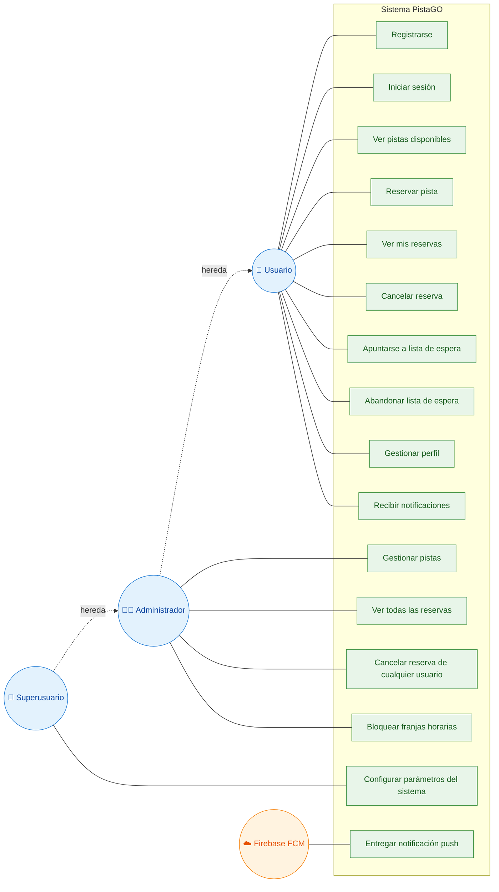

# Diagrama de Casos de Uso — PistaGO

Casos de uso del sistema PistaGO. Se identifican cuatro actores: **Usuario** (socio del club), **Administrador**, **Superusuario** y el sistema externo **Firebase Cloud Messaging**. Los actores Administrador y Superusuario heredan los casos de uso del Usuario (relación de generalización), y el Superusuario hereda además los del Administrador.

> Nota sobre la herencia: el Administrador puede hacer todo lo que hace un Usuario (reservar, gestionar su perfil, etc.) **más** sus casos específicos de gestión. El Superusuario, a su vez, puede hacer todo lo del Administrador más la configuración global del sistema.

---

## Descripción de los casos de uso

### Casos de uso del Usuario

| Caso de uso | Descripción |
|-------------|-------------|
| Registrarse | Crear una cuenta nueva con nombre, email y contraseña. |
| Iniciar sesión | Autenticarse con email y contraseña; recibe un token JWT. |
| Ver pistas disponibles | Consultar el listado de pistas activas y su disponibilidad. |
| Reservar pista | Reservar una pista en una fecha y franja horaria libres. |
| Ver mis reservas | Consultar el historial y las reservas activas propias. |
| Cancelar reserva | Anular una reserva propia confirmada. |
| Apuntarse a lista de espera | Unirse a la cola de una franja ocupada para ser avisado si se libera. |
| Abandonar lista de espera | Salir voluntariamente de una cola de espera. |
| Gestionar perfil | Editar nombre y teléfono, subir foto de perfil y cambiar la contraseña. |
| Recibir notificaciones | Recibir avisos push (turno de espera, cancelaciones, recordatorios...). |

### Casos de uso del Administrador

| Caso de uso | Descripción |
|-------------|-------------|
| Gestionar pistas | Crear pistas nuevas, editar sus datos y activarlas o desactivarlas. |
| Ver todas las reservas | Consultar las reservas de todos los usuarios del club. |
| Cancelar reserva de cualquier usuario | Anular reservas ajenas (con registro de quién canceló y motivo). |
| Bloquear franjas horarias | Reservar franjas para mantenimiento, torneos u otros eventos. |

### Casos de uso del Superusuario

| Caso de uso | Descripción |
|-------------|-------------|
| Configurar parámetros del sistema | Ajustar horarios de apertura/cierre, límite de reservas semanales, antelación mínima de cancelación, duración de franjas, etc. |

### Caso de uso del sistema externo (Firebase)

| Caso de uso | Descripción |
|-------------|-------------|
| Entregar notificación push | FCM recibe la solicitud del backend y entrega la notificación al dispositivo del usuario destinatario. |

---

## Flujo detallado de un caso de uso representativo

### Caso de uso: Apuntarse a lista de espera y recibir turno

**Actor principal:** Usuario
**Actor secundario:** Firebase FCM

**Precondiciones:**
- El usuario ha iniciado sesión.
- La franja horaria deseada está ocupada por otra reserva confirmada.

**Flujo normal:**
1. El usuario consulta la disponibilidad de una pista y selecciona una franja ocupada.
2. El usuario solicita apuntarse a la lista de espera de esa pista y franja.
3. El sistema verifica que el usuario no esté ya en esa cola.
4. El sistema añade al usuario a la cola y le indica su posición.
5. *(Más tarde)* El usuario que tenía la reserva la cancela.
6. El sistema detecta la cancelación y busca al primer usuario de la cola no notificado.
7. El sistema solicita a Firebase FCM el envío de una notificación push.
8. Firebase entrega la notificación al dispositivo del usuario.
9. El sistema registra la notificación en el historial y marca al usuario como notificado.

**Flujos alternativos:**
- *3a.* Si el usuario ya está en la cola: el sistema rechaza la solicitud con un mensaje de error.
- *7a.* Si el usuario no tiene token FCM registrado: el sistema registra la notificación en el historial pero no envía push.

**Postcondiciones:**
- El usuario queda en la lista de espera (flujo normal hasta el paso 4).
- El usuario recibe el aviso de que se ha liberado la plaza (flujo completo).
